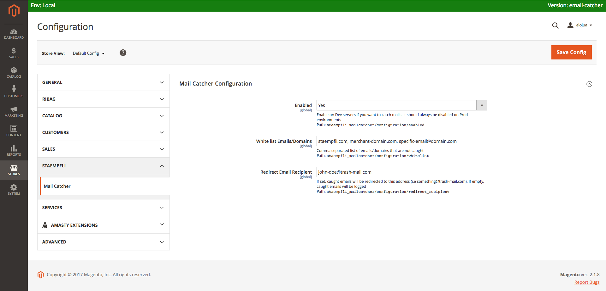

# Magento 2 Mail Catcher

[](https://www.codacy.com/app/Staempfli/magento2-module-mailcatcher?utm_source=github.com&amp;utm_medium=referral&amp;utm_content=staempfli/magento2-module-mailcatcher&amp;utm_campaign=Badge_Grade)
[](https://codeclimate.com/github/staempfli/magento2-module-mailcatcher)
[](https://codeclimate.com/github/staempfli/magento2-module-mailcatcher)

Magento 2 module to catch, log and redirect emails on local and stage enviroments.

Features:

* Catch and log all emails
* Whitelist domains or emails that you do not want to catch (Merchant domain, developer emails)
* Redirect catched emails to a [trash-mail](https://www.trash-mail.com/inbox/) instead of logging them

## Introduction

Although the recommended way to catch emails is using a mailCatcher like [MailHog](https://github.com/mailhog/MailHog), this is not always easy to setup in all environments and configurations:

Facts:

* Not all your developers have same local systems and configurations
* Stage servers might use different mail transfer agents (sendmail, postfix)
* Projects might use the merchant STMP server for sending emails
* Merchants want to test how real emails are sent and not use a catching Web UI

If you have these problems, that's when this module comes in handy. This module catches emails before they reach the transfer agent. No extra tools needed for your projects, simply install and enable it on Magento Admin.


## Installation

```
$ composer require "staempfli/magento2-module-mailcatcher":"~1.0"
```

## Usage

`Magento Admin > Stores > Configuration > Staempfli > Mail Catcher`



## Disclaimer

This module uses a plugin on `Magento\Framework\Mail\TransportInterfaceFactory::create()`, watch out that your code or other modules installed do not overrite that method.

See: [etc/di.xml](etc/di.xml)

## Tests

In order to prove that the mail catcher always work, we recommend you to run included integration tests on your CI environment. Add this into your `dev/tests/integration/framework/phpunit.xml`:

```
<directory suffix="Test.php">&magentoDir;/vendor/staempfli/magento2-module-mailcatcher/*/Test/Integration</directory>
```

## Prerequisites

- PHP >= 7.0.*
- Magento >= 2.1.*

## Developers

Juan Alonso, and all other [contributors](https://github.com/staempfli/magento2-module-mailcatcher/contributors)

## License

[Open Software License ("OSL") v. 3.0](https://opensource.org/licenses/OSL-3.0)

## Copyright

(c) 2017, Stämpfli AG
